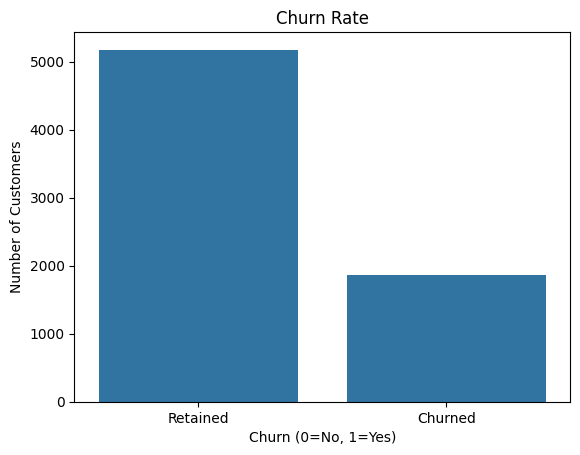
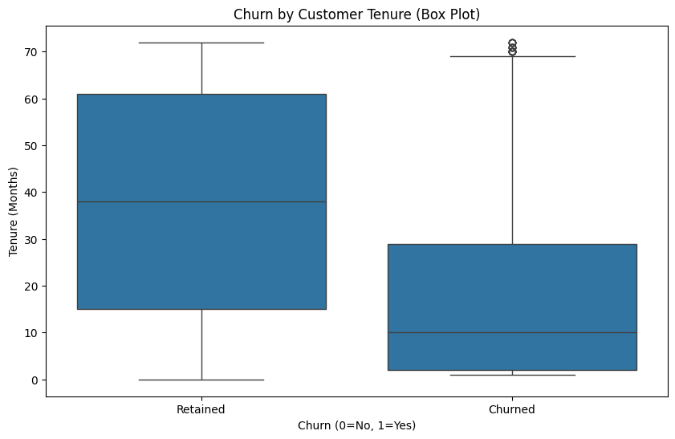
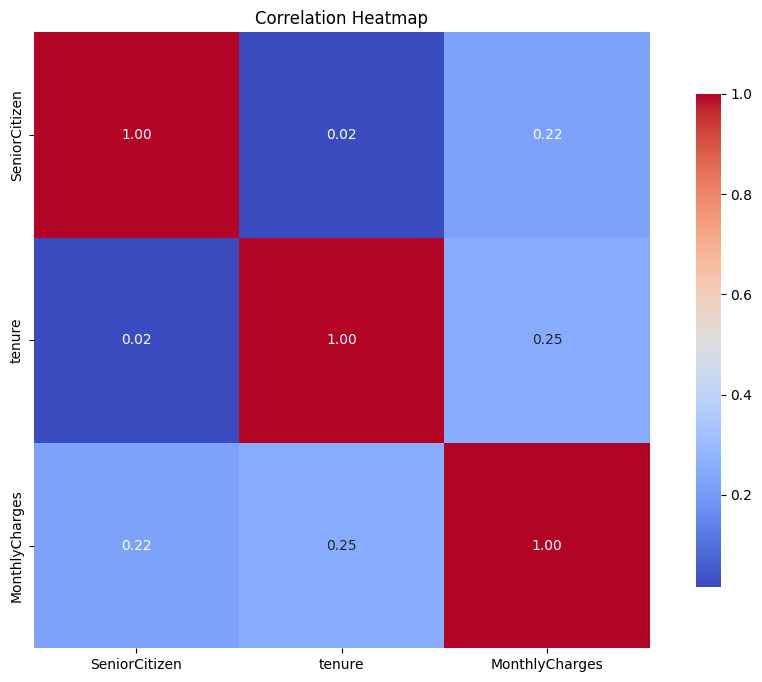
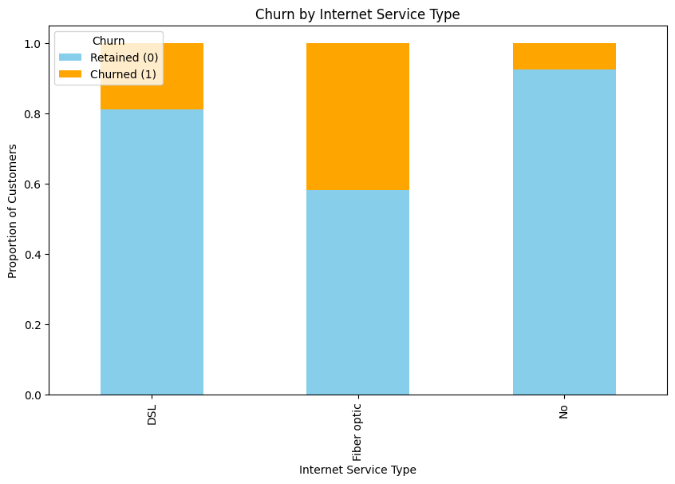
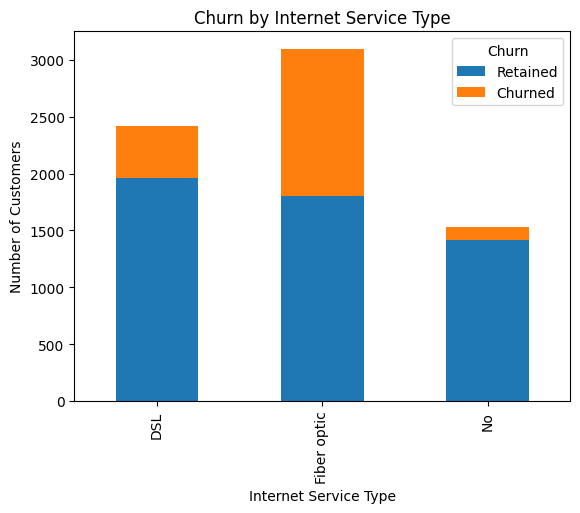
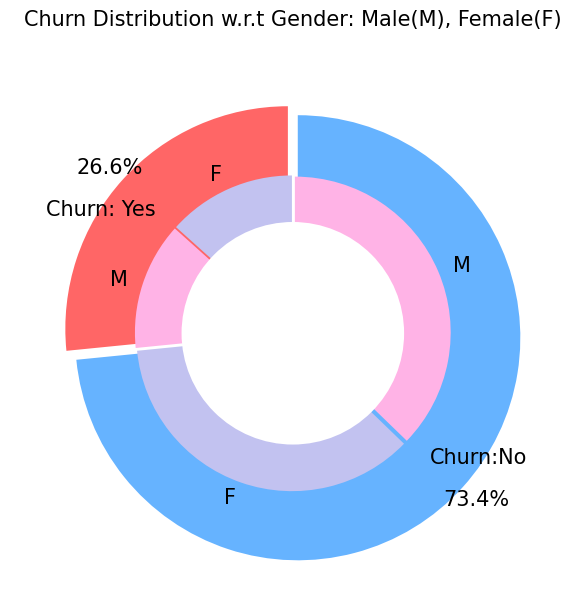
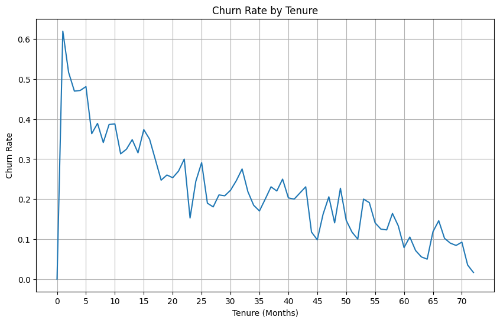
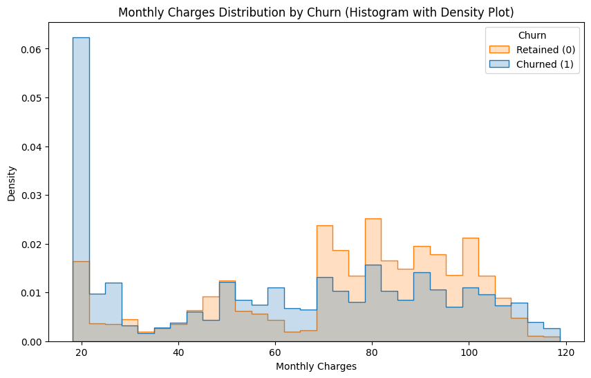

# Customer-Churn-Prediction

## Introduction

This project aims to predict customer churn using various machine learning techniques. The Telco Customer Churn dataset was used for this purpose. The project involves data exploration, visualization, feature engineering, model training, and evaluation to achieve accurate churn prediction.

## Dataset

The Telco Customer Churn dataset, obtained from Kaggle, contains information about customers of a telecommunications company, including their demographics, services, account details, and churn status.

## Project Workflow

1. **Data Loading and Exploration**:
   - Loading the Telco Customer Churn dataset using Pandas.
   - Exploring the dataset's structure, dimensions, and data types.
   - Handling missing values by imputation or removal.
   - Performing descriptive statistics to understand data distribution.

2. **Data Visualization**:

    This section presents various visualizations to gain insights into the data:

    ### Churn Rate

    

    This bar chart illustrates the overall churn rate, showing the proportion of customers who have churned compared to those who have not.

    ### Churn by Tenure

    

    This box plot visualizes the distribution of customer tenure for both churned and retained customers. It helps identify potential trends in churn based on how long customers have 
    been with the company.

    ### Correlation Heatmap

    

    This heatmap displays the correlations between different numerical features in the dataset. It highlights potential relationships between variables that might influence churn.

    ### Churn by Internet Service Type

    

    This stacked bar chart shows the churn rates for different internet service types. It helps identify which internet services are more prone to churn.

    ### Churn by Internet Service

    

    This bar chart further explores the relationship between churn and internet service types, potentially highlighting specific services with higher churn rates.

    ### Churn Distribution w.r.t Gender

    

    This pie chart or bar chart visualizes the churn distribution with respect to gender. It helps understand if there are any gender-based patterns in churn.

    ### Churn vs Tenure

    

    This line plot or scatter plot shows the relationship between churn and customer tenure. It helps visualize how churn rates change over time as customers stay longer with the 
    company.

    ### Monthly Charges Distribution by Churn

    

    This histogram or density plot shows the distribution of monthly charges for both churned and retained customers. It helps identify potential patterns in churn based on monthly 
    charges.

3. **Feature Engineering**:
   - Converting data types.
   - Scaling numerical features using standardization or normalization.
   - Potentially creating new features based on existing ones.

4. **Model Training and Evaluation**:
   - Training various classification models:
     - Logistic Regression
     - Random Forest
     - XGBoost
     - Deep Learning (Keras)
   - Evaluating model performance using metrics like:
     - Accuracy
     - Precision
     - Recall
     - F1-score
     - Confusion Matrix
     - Classification Report

## Results

The following table summarizes the performance of the different models:

| Model | Accuracy | Precision | Recall | F1-Score |
|---|---|---|---|---|
| Logistic Regression | 0.804 | 0.65 | 0.56 | 0.60 |
| Random Forest | 0.787 | 0.63 | 0.49 | 0.55 |
| Optimized Random Forest (GridSearchCV) | 0.796 | 0.65 | 0.52 | 0.58 |
| XGBoost | 0.797 | 0.64 | 0.53 | 0.58 |
| Optimized XGBoost (GridSearchCV) | 0.800 | 0.65 | 0.54 | 0.59 |
| Deep Learning (Keras) | 0.794 | 0.63 | 0.52 | 0.57 |

**Optimized Random Forest Hyperparameters:**
- The `GridSearchCV` found the following best hyperparameters for Random Forest: {best_parameters_for_random_forest}

**Optimized XGBoost Hyperparameters:**
- The `GridSearchCV` found the following best hyperparameters for XGBoost: {best_parameters_for_xgboost}

## Conclusion

The project demonstrates the application of various machine learning models for predicting customer churn. Logistic Regression, Random Forest, and XGBoost models achieved similar accuracy scores around 80%. Further analysis and fine-tuning of hyperparameters might improve performance. Deep Learning model showed decent performance, but traditional models performed better in this project.

## Future Work

- Explore more advanced feature engineering techniques.
- Experiment with other classification models like Support Vector Machines or Naive Bayes.
- Fine-tune hyperparameters using techniques like GridSearchCV or RandomizedSearchCV.
- Deploy the model for real-time churn prediction.

## Usage

The Jupyter Notebook provided in this repository contains the code for data loading, exploration, visualization, feature engineering, model training, and evaluation. Run the notebook step-by-step to reproduce the results.

## Dependencies

- Python 3.x
- Pandas
- NumPy
- Scikit-learn
- XGBoost
- TensorFlow/Keras
- Matplotlib
- Seaborn
- Plotly

## Acknowledgments

- The Telco Customer Churn dataset from Kaggle.
- The scikit-learn, XGBoost, and TensorFlow/Keras libraries for machine learning.
- The Matplotlib, Seaborn, and Plotly libraries for data visualization.

